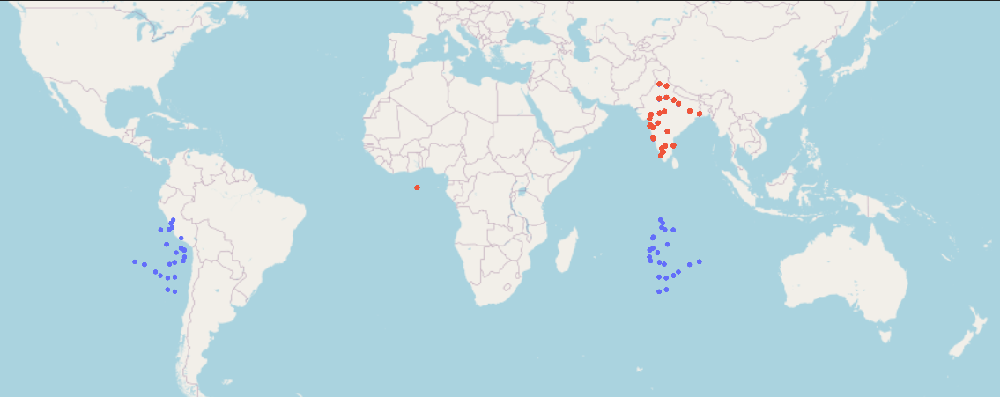

# Previsão do tempo de entrega de alimentos: Estudo de Caso
A previsão do tempo de entrega de comida é um aspecto crucial do setor de entregas de alimentos. **Previsões** precisas ajudam a **melhorar a satisfação do cliente, otimizar as operações de entrega e reduzir o tempo de espera**. Aqui está um estudo de caso que descreve as etapas envolvidas na construção de um modelo de previsão do tempo de entrega de comida.

> [!NOTE]
> Este estudo de caso está no site do **Kaggle** - [Food Delivery Time Prediction: Case Study](https://www.kaggle.com/datasets/bhanupratapbiswas/food-delivery-time-prediction-case-study/)

# Problema de negócio:
Uma popular empresa de entrega de comida quer aprimorar a experiência do cliente fornecendo estimativas precisas do tempo de entrega. Ela recebe um número significativo de pedidos diariamente, e os clientes frequentemente reclamam de atrasos nas entregas. A empresa pretende construir um modelo de aprendizado de máquina que possa prever o tempo de entrega com base em diversos fatores, a fim de minimizar os atrasos e melhorar a satisfação geral do cliente.

# Plano de Ação
Este estudo de caso foi dividido em duas partes:
1. **Parte I**: Essa etapa foi realizada o pré-processamento ddos dados:
    O pré-processamento de dados é essencial para garantir que os dados sejam adequados para a modelagem. Esta fase envolve:
    - **Tratamento de valores ausentes**: imputação ou remoção de dados faltantes ou discrepantes.
    - **Análise Exploratória**: análise dos dados para extração de insights para a empresa 
    - **Engenharia de funcionalidades**: Criação de novas funcionalidades que podem melhorar o desempenho do modelo, como distância entre locais, etc.
    - **Codificação de variáveis ​​categóricas**: Converter características categóricas em formato numérico usando técnicas como codificação one-hot ou codificação de rótulos. 

> O código-fonte está disponível em: [PARTE I.ipynb](https://github.com/rrafahenrique/Estudo-de-Caso-Food-Delivery-Time-Prediction/blob/master/PARTE%20I.ipynb)

2. **Parte II**: Os dados foram divididos em conjuntos de treinamento e teste para treinar os modelos. Os modelos são avaliados usando métricas como Erro Médio Absoluto (MAE) ou Raiz do Erro Quadrático Médio (RMSE) para medir o quão bem os tempos de entrega previstos correspondem aos tempos de entrega reais.

    Neste projeto foram utilizados 5 modelos de regressão para prever o tempo de entrega com base nos dados pré-processados.
    - Linaer Regression
    - Lightgbm
    - Random Forest Regressor
    - XGBoost
    - CatBoost

    Foi realizado um ajuste de hiperparâmetros para otimizar o desempenho dos modelos que tiveram melhor resultado. 

> O código-fonte está disponível em: [PARTE II.ipynb](https://github.com/rrafahenrique/Estudo-de-Caso-Food-Delivery-Time-Prediction/blob/master/PARTE%20II.ipynb)

> [!IMPORTANT]
> Neste projeto foi usado a biblioteca `plotly.express` para gerar mapas iterativos com a localização dos restaurantes e locais de entrega.
> 
>
> Entretanto, o Github não consegui exibir de forma correta essa informação, é altamente recomendado que este projeto seja executado no seu próprio computador. 
>
> Clone este projeto e excute o `requirements.txt`.
>
> ```
> pip install -r requirements.txt
>```
> 