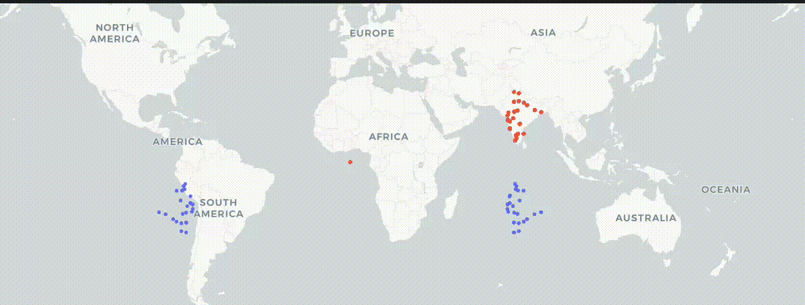

# Previsão do tempo de entrega de alimentos: Estudo de Caso
A previsão do tempo de entrega de comida é um aspecto crucial do setor de entregas de alimentos. **Previsões** precisas ajudam a **melhorar a satisfação do cliente, otimizar as operações de entrega e reduzir o tempo de espera**. Aqui está um estudo de caso que descreve as etapas envolvidas na construção de um modelo de previsão do tempo de entrega de comida.

> [!NOTE]
> O dataset utilizado neste projeto está disponínel originalmente no site do **Kaggle** - [Food Delivery Time Prediction: Case Study](https://www.kaggle.com/datasets/bhanupratapbiswas/food-delivery-time-prediction-case-study/)

# Problema de Negócio
Uma popular empresa de entrega de comida quer aprimorar a experiência do cliente fornecendo estimativas precisas do tempo de entrega. Ela recebe um número significativo de pedidos diariamente, e os clientes frequentemente reclamam de atrasos nas entregas. A empresa pretende construir um modelo de aprendizado de máquina que possa prever o tempo de entrega com base em diversos fatores, a fim de minimizar os atrasos e melhorar a satisfação geral do cliente.

# Estrutura do Projeto
Inicialmente foi analisado o dataset, suas variáveis e tipagem das colunas, depois foi realizado o pré-processamento de dados etapa essencial para garantir que os dados sejam adequados para a modelagem. Esta fase envolveu:
- **Tratamento dos Dados**: estudo sobre os dados discrepantes fornecidos sobre latitude e longitude;
- **Análise Exploratória**: análise dos dados para extração de insights de negócios;
- **Feature Engineering***: Criação de novas funcionalidades que podem melhorar o desempenho do modelo, como distância entre locais, avaliação dos entregadores e etc.
- **Codificação de variáveis ​​categóricas**: Converter características categóricas em formato numérico usando técnicas como codificação one-hot ou codificação de rótulos. 

Para a etaoa de modelagem os dados foram divididos em conjuntos de treinamento e teste para treinar os algoritmos de Machine Learning. Os modelos foram avaliados usando métricas como **MAE (Mean Absolute Error)**, **MSE (Mean Squared Error)**, **R² (Coeficiente de Determinação)** e **MAPE (Mean Absolute Percentage Error)** para medir o quão bem os tempos de entrega previstos correspondem aos tempos de entrega reais.

Neste projeto foram utilizados 5 modelos de **regressão** para prever o tempo de entrega com base nos dados pré-processados.
- Linaer Regression
- Lightgbm
- Random Forest Regressor
- XGBoost
- CatBoost

Foi realizado um ajuste de **hiperparâmetros com Optuna** para otimizar o desempenho dos modelos que tiveram melhor resultado. 

> O código-fonte está disponível em: [main.ipynb](https://github.com/rrafahenrique/Estudo-de-Caso-Food-Delivery-Time-Prediction/blob/master/main.ipynb)

---

> [!IMPORTANT]
> Na seção "2. Tratamento dos Dados" para ilustatr a localização dos restaurantes e locais de entrega foi usada a biblioteca `plotly.express` para gerar mapas iterativos. 
> 
>
> Entretanto, o Github não consegui exibir de forma correta essa informação, é altamente recomendado que este projeto seja executado no seu próprio computador. 
>
> Clone este projeto e execute o `requirements.txt`.
>
> ```
> pip install -r requirements.txt
>```
> 
